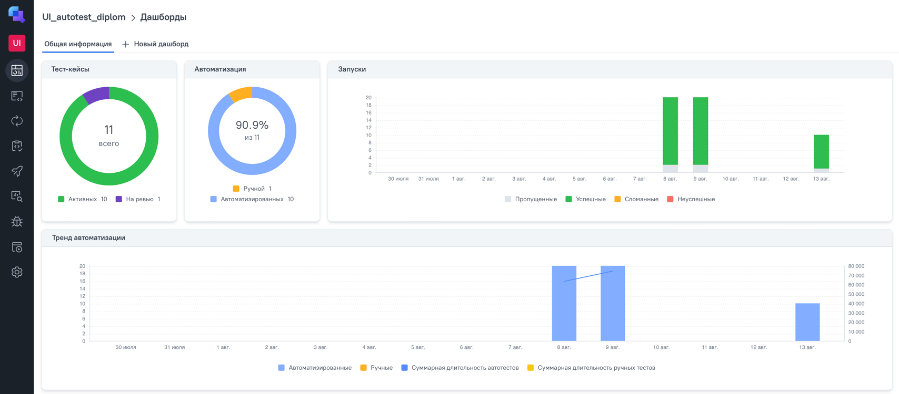
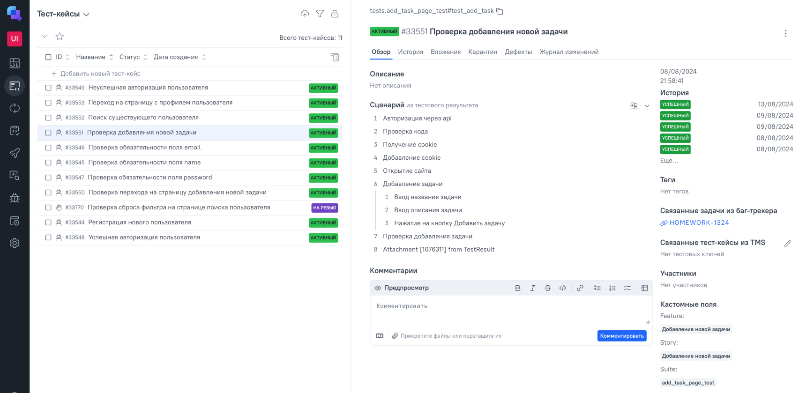

# Дипломный проект QA.GURU (UI-тестирование)

Данный репозиторий содержит проект - UI тестирование - часть дипломной работы, выполненной в рамках обучения на курсах QA.GURU. Проект разработан с целью продемонстрировать полученные навыки и знания в области тестирования программного обеспечения.

## Используемые инструменты
<div>
&nbsp
&nbsp
&nbsp
&nbsp
&nbsp
&nbsp
&nbsp
 
&nbsp
&nbsp
</div>

## Список автоматизированных тест-кейсов:
1. Проверка успешной регистрации нового пользователя
2. Проверка полей в форме регистрации на обязательность
3. Проверка успешной авторизации
4. Проверка неуспешной авторизации
5. Проверка поиска существующего пользователя
6. Проверка открытия страницы с профилем пользователя
7. Проверка открытия страницы для добавления новой задачи в личном кабинете пользователя (авторизация через API)
8. Проверка добавления новой задачи в личном кабинете пользователя (авторизация через API)

## Запуск тестов и получение отчета

### **Локально**

<details><summary>1. Склонировать репозиторий</summary>

```
git clone https://github.com/KateVarg/UI_autotests_diplom
```
</details>

<details><summary>2. Установить зависимости и запустить тесты</summary>

```
python -m venv .venv
source .venv/bin/activate
pip install poetry
poetry install
pytest .
```
</details>

<details><summary>3. Получить отчет о прохождении тестов в allure</summary>

```
allure serve allure-results/
```
</details>

<details><summary>4. После выполнения команды откроется браузер с отчетом</summary>
    


</details>

### **Удалённо**

Удаленный запуск автотестов осуществляется при помощи Jenkins. Для этого необходимо выполнить следующие действия:

1. Открыть [проект на Jenkins](https://jenkins.autotests.cloud/job/UI_autotest_diplom/)

<details><summary>2. Нажать на Build now</summary>


</details>

<details><summary>3. Дождаться окончания выполнения автотестов и нажать на иконку allure  для просмотра отчета</summary>


</details>

##  Отчет в <a href = "https://jenkins.autotests.cloud/job/UI_autotest_diplom/8/allure/#behaviors">Allure report</a>

<details><summary>Основной отчет</summary>


</details>
<details><summary>Тесты</summary>


</details>

##  Отчет в <a href = "https://allure.autotests.cloud/project/4363/dashboards">Allure TestOps</a>

<details><summary>Основной отчет</summary>



</details>

<details><summary>Тесты</summary>



</details>

## **Дополнительно**

Реализована отправка результатов тестирования в Telegram   
<details><summary>Пример отчета</summary>


</details>
